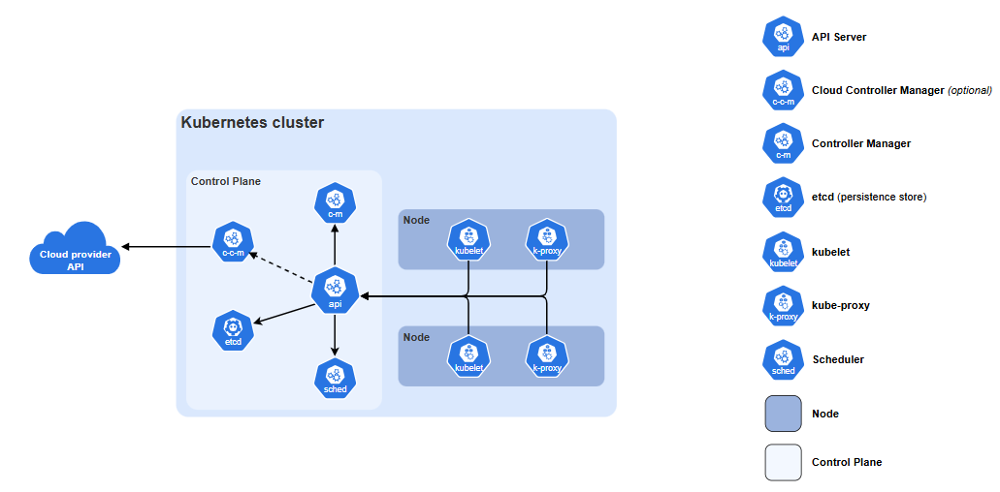

# 쿠버네티스 컴포넌트

# 핵심 컴포넌트
쿠버네티스 클러스터는 `컨트롤 플레인`과 `하나 이상의 워커 노드`로 구성된다.

## 컨트롤 플레인 컴포넌트
클러스터 전체 상태를 관리한다.

### kube-apiserver
쿠버네티스 http api를 노출하는 핵심 서버 컴포넌트

### etcd
모든 api 서버 데이터를 위한 일관성과 고가용성을 갖춘 키-밸류 저장소

### kube-schedular
아직 노드에 할당되지 않은 파드를 찾아 적절한 노드에 할당

### kube-controller-manager
컨트롤러를 실행해 쿠버네티스 api 동작 구현

### cloud-controller-manager (선택)
외부 클라우드 공급자와 통합

## 노드 컴포넌트
모든 노드에서 실행되며, 실행 중인 파드를 유지하고 쿠버네티스 런타임 환경을 제공한다.

### kubelet
파드와 그 안의 컨테이너 실행 중임을 보장

### kube-proxy (선택)
노드에서 네트워크 규칙을 유지하여 서비스를 구현

### 컨테이너 런타임
컨테이너 실행을 담당하는 소프트웨어

## 애드온
쿠버네티스 기능을 확장한다.

### DNS
클러스터 전반의 DNS 해석 담당

### 웹 UI
웹 인터페이스를 통한 클러스터 관리 제공

### 컨테이너 리소스 모니터링
컨테이너 매트릭 수집

### 클러스터-레벨 로깅
컨테이너 로그를 저장