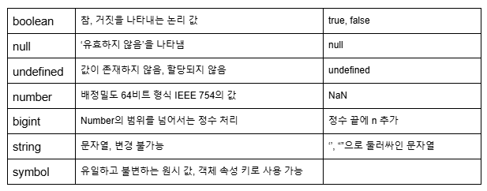

# 타입스크립트
타입스크립트(TypeScript)는 마이크로소프트에서 개발한 언어이다.</br>
자바스크립트 코드에 타입 시스템을 도입한 확장적인 언어이다.</br>
정적 프로그램 분석으로 에러 발생 가능성이 있는 코드를 찾아준다.

## 변수 선언 방법
타입스크립트 변수 선언 방법은 자바스크립트와 동일하게 const, let, var 들로 할 수 있다.</br>
자세한 설명은 [작성했던 글](https://velog.io/@dnslfkrh/js-ts-%EB%B3%80%EC%88%98-%EC%84%A0%EC%96%B8-%EB%B0%A9%EB%B2%95)을 참고하자.

### 지원하는 타입
타입스크립트는 자바스크립트가 가지고 있는 모든 자료형을 포함한다.</br>
자바스크립트의 타입은 값(primitive value), 객체(object), 함수(function)이 있다.</br>
typeof 키워드를 통해 인스턴스의 타입을 알 수 있다.





## 객체 타입
객체 타입은 속성(프로퍼티, property)을 가지고 있는 데이터 컬렉션이다.

```typescript
const dexter = {
    name: "Dexter Han",
    age: 21,
    hobby: ["Movie", "Book"]
}
```

## 함수 타입
자바스크립트는 함수를 변수에 할당하거나 다른 함수의 인수로 전달 가능하다. 이러한 특징을 일급 함수(first-class function)이라고 한다.

```typescript
// 함수 타입 선언: (매개변수: 타입) => 반환값 타입
let add: (a: number, b: number) => number;

add = (a: number, b: number) => {
    return a + b;
};

console.log(add(2, 3)); // 출력: 5
```

## any 타입
자바스크립트와 비슷하게 어떠한 타입도 값으로 받을 수 있는 타입이다. 타입 검사에서 제외된다.

```typescript
let value: any = "Hello";
value = 12;
value = true;

console.log(value); // 출력: true
```

## unknown 타입
any 타입과 비슷하지만, 다른 변수에 할당 및 사용할 때 타입을 강제하여 any보다 오류를 줄여준다. 타입 검사를 거치지 않으면 사용할 수 없다.

```typescript
let input: unknown = "Hello World!";

if (typeof input === "string") {
    console.log(input.toUpperCase()); // 타입 검사 필요
}
```

## never 타입
변수에 어떠한 값도 할 수 없다. 결코 발생하지 않는 값이 함수의 반환 타입에 사용된다.

```typescript
function throwError(message: string): never {
    throw new Error(message);
}

function infiniteLoop(): never {
    while(true) {}
}
```

## 타입 추상화 (Type Abstraction)
인터페이스 또는 클래스를 통해 데이터 구조의 형태를 정의하고 이를 기반으로 타입을 분리하는 개념이다.</br>
세부 구현에 의존하지 않고 공통된 형태를 정의함으로써 코드의 의존성을 줄일 수 있다.


## 구조적 타입화 (Structural Typing)
타입스크립트는 구조적 타입 시스템을 사용한다.</br>
그 뜻은 타입의 이름이 아니라 구조가 같으면 같은 타입으로 간주한다는 뜻이다.


### 타입 추상화 및 구조적 타입화 예제

```typescript
interface Animal {
    name: string;
    speak(): void;
}

class Dog implements Animal {
    constructor(public name: string) { }

    speak() {
        console.log(`$this.name) says woof!`);
    }
}

class Cat implements Animal {
    constructor(public name: string) { }

    speak() {
        console.log(`$this.name) says meow!`);
    }
}

const dog: Animal = new Dog("Minsu");
const cat: Animal = new Cat("Minji");

dog.speak(); // 출력: Minsu says woof!
cat.speak(); // 출력: Minji says meow!
```

## 요약
타입 추상화: 세부 사항을 숨기고 공통된 인터페이스 또는 클래스로 타입을 정의하는 과정이다.</br>
구조적 타입화: 구조가 동일하면 같은 타입으로 간주하는 타입스크립트의 특성이다.


## type 키워드
새로운 타입을 만들 수 있다.

```typescript
type MyUser = User;
```

## 제네릭 타입
Java와 C#에서의 제네릭과 유사한 기능을 한다.
어떤 타입이든 정의될 수 있으며, 호출되는 시점에 그 타입이 결정된다.

```typescript
function identityAny(arg: any): any /* 반환 값은 any타입으로 */ {
    return arg; 
}

function identity<T>(arg: T): T /* 반환 값의 타입은 함수 호출 시점의 인수로 넣은 타입으로 결정됨 */ {
    return arg;
}
```

